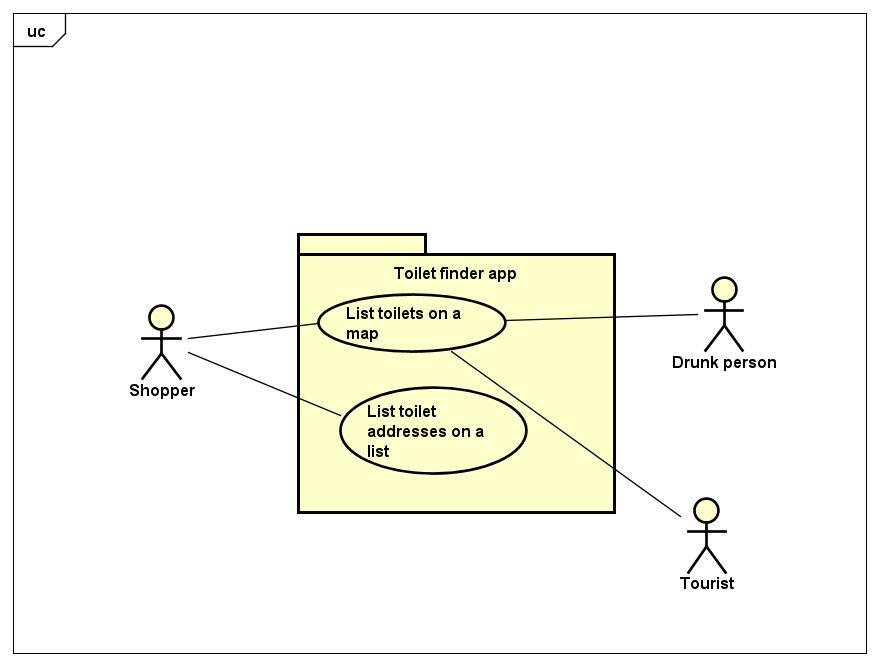

# Requirements

## User Needs

### User stories
As a drunk person, or just someone out who needs to use the toilet in general, I would like to know the nearest toilet is so I can move on quickly to the next club or bar or party. 
As a shopper, I would like to spend more time shopping and less time hunting around for a toilet. 
As a tourist, I would like to know these toilet locations in advance in order to plan my day out so I can alleviate possible stress from being in a foreign and unfamiliar city. 
As someone out late at night, I would like to know these locations in order to have a safe space to retreat to if needed. 

### Actors
Tourists - People who may not know local directions 
Shoppers - People just looking for a quick toilet nearby 
Drunk people - May not be able to find a toilet by themselves while under the influence 
People that need the toilet 

### Use Cases
UC1 - Find toilets using map 
UC2 - Find toilets by address

| UC1 | Find toilets using a map | 
| -------------------------------------- | ------------------- |
| **Description** | Shows all toilets on a map |
| **Actors** | Drunk people, tourists, people that need the toilet |
| **Assumptions** | The user has a device with GPS capabilites </td></tr>
| **Steps** | <ol><li> User loads app</li><li>User gives permission to let their location be tracked</li><li>Show all available public toilets on the map</li></ol> |
| **Variations** | Icons displaying the toilet locations on the map can change, and the public toilets which are available may be edited and changed and moved but still load even if the user doesn't give permission to let their permission be tracked. |
| **Non-functional** | The public toilets locations must show on a map. |
| **Issues** |  |

| UC2 | Find toilets using address | 
| -------------------------------------- | ------------------- |
| **Description** | Shows all nearby public toilets in a list including their locations by address |
| **Actors** | Local Citizens, Shoppers |
| **Assumptions** | The user has a device capable of running the app as well as knowledge of addresses / a way to arrive at specific addresses </td></tr>
| **Steps** | <ol><li> User loads map</li><li>User inputs their own current location / give permission to let their location be tracked</li><li>Show all available public toilets and their distance to the user in a list</li></ol> |
| **Variations** | The locations must still load regardless of whether or not permission is given for their location to be tracked, or if an invalid location or none is given then a null value for the distance to user is given. |
| **Non-functional** | The public toilets addresses must be displayed in a list. |
| **Issues** |  |

## Software Requirements Specification
### Functional requirements

FR1.* are derived from UC1.
FR1.1: The system should be able to load the page
FR1.2: The system should be able to load the map of Bristol
FR1.3: The system should be able ask for permission to use their location
FR1.4: The system should have be able to locate where the user is on the map
FR1.5: The system should load all toilet locations via markers on the map.

FR2.* are derived from UC2.

FR2.1: The system should be able to collect the data of where the public toilets are from Open Data Bristol 
FR2.2: The system should ask/obtain permission from the user to access their location or have the user input a location 
FR2.3: The system should display both user location and public toilet locations using markers of some kind 
FR2.4: The system should display the distances between the user location and public toilet locations 
FR2.5: The system should list all the public toilet locations in a list displaying the distances to them and their general area 

### Non-Functional Requirements
TODO: Consider one or more [quality attributes](https://en.wikipedia.org/wiki/ISO/IEC_9126) to suggest a small number of non-functional requirements.
Give each non-functional requirement a unique ID. e.g. NFR1, NFR2, ... 

NFR1.* are derived from UC1.

NFR1.1: The system should show further details about the exact locations of the toilets.  
NFR1.2: The system should somehow note the nearest toilet in regards to the user's location.  
NFR1.3: The system should also be able to find toilets via area boundaries rather than just specific locations or addresses.  

NFR2.* are derived from UC2.

NFR2.1: The system should use a default location of either the previous location inputted or the Bristol City Centre (Reliability) 
NFR2.2: The previouslt inputted location by the user should be saved in a secure and encrypted location (Security) 
NFR2.3: Source code should be available on GitHub (Maintainability) 
NFR2.4: The app should work on a standard iPhone or android phone screen, but also fit to PC screens (Portability) 
NFR2.5: The app should be quick to respond to the user's requests (Performance efficiency) 
NFR2.6: The app should also work on website browsers (Compatibility) 
NFR2.7: The markers shouldn't be so big that they obscure the map or negatively impact usage (Usability) 
NFR2.8: Data should be regularly checked and updated (Functional suitability) 

Indicate which UC the requirement comes from.
